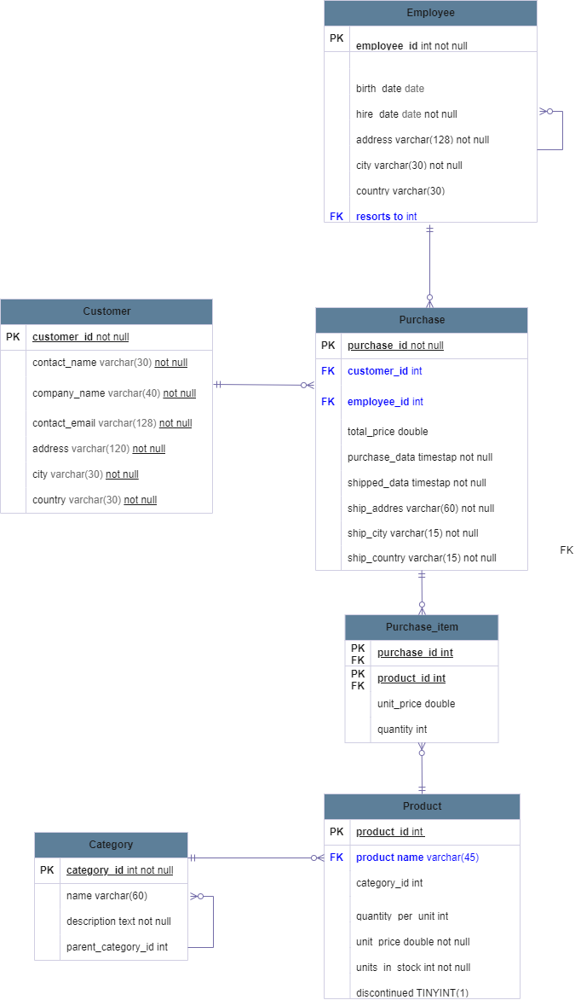
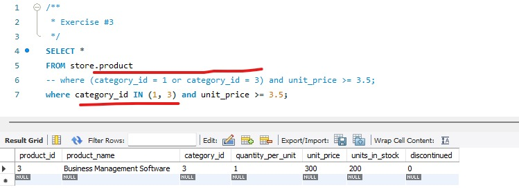

## Store Database Project sql

A store has a lot of information. For example, a product has a brand, a category, a price, etc
and since there is so much information in a store, I tried to represent the data of a store in a SQL database.

This image is a graphical representation of what I want to achieve with this database:

### Install

To install do you need to execute this code in the cmd

git clone https://github.com/kevin-pb/sql-task-02-store.git

### Docker

The second thing that you need to do is to download Docker Desktop, once download Docker Desktop you need to execute in the cmd the command:

docker pull mysql

once you execute the command do you need to execute in the file in the file where the Docker compose is the following command:

docker-compose up -d 

### Worckbench

Now you need to download MySQL Workbench once you download MySQL Workbench you can charge and run the follow files, they are located in the main file (sql-tasck-01-school):

- 1-init.01.skeleton
- 2-init.02.seeder
- 3-task-02-store

With all that clarified I set out to solve the following problems:

- Exercise1: Display all data present in the product table.

- Exercise2: Display the names of products with a unit price greater than or equal to 3.5.

- Exercise3: Display the data for all products in categories with an ID of 1 (Food) or 5 (Fruits and Vegetables) and with a unit price greater than 3.5.

- Exercise4: Select product names along with their categories. Display two columns: product_name and category_name.

- Exercise5: For each purchase, display the purchase ID, product name, unit price at the time of purchase, and quantity of 

- Exercise6: For each purchase, display all product categories purchased in this purchase. Display each category only once for each purchase.

- Exercise7: Display the data for all categories. Sort the categories by name in ascending order (A to Z).

- Exercise8: Display the last names, first names, and dates of birth of employees. Sort the results by the employee's age in ascending order (Hint: Use the birth_date column).

- Exercise9: Display the data for all products, sorting the results by the number of units in descending order and by the product name in ascending order.

- Exercise10: For each product category, display its name and find the average unit price. Display two columns: name and average_unit_price.

The solution to these problems is found in:[task-02-store](https://github.com/kevin-pb/sql-task-02-store/blob/master/task-02-store.sql) 

### A little more:

